# Health Decoded 13-Day Curriculum Optimization Review

**Review date:** July 22, 2026

**Published scope:** Days 1–13

**Review lens:** instructional ownership, repetition, cognitive load, progression, interaction purpose, emotional safety, medical accuracy, and practical transfer

## Executive decision

The published curriculum has a strong overall arc and does not need a wholesale rewrite. Its best material is specific, visual, reassuring, and action-oriented. The most valuable changes were boundary changes: remove one duplicated lesson segment, give repeated ideas a clear owner, repair inaccurate transitions, and align database summaries with the learner-visible experiences.

The optimized arc now moves through five distinct jobs:

1. **Orient:** make the diagnosis understandable and emotionally survivable.
2. **Explain:** build a body model, then teach how laboratory information is read.
3. **Apply:** translate food, movement, medication, and monitoring into usable decisions.
4. **Protect:** recognize safety signals, reduce decision load, and use preventive care.
5. **Adapt and connect:** solve changed conditions and ask other people for support without surrendering choice.

The current product contains 13 published lessons. The source review requested Lessons 1–14, but no approved Lesson 14 manuscript or built experience exists in this workspace. This review does not invent medical curriculum to fill that gap. The false Day 13 promise of “Tomorrow · The final lesson” was removed, so the interface now ends honestly at the published endpoint.

## Curriculum concept map

```mermaid
flowchart LR
  D1[Day 1\nDiagnosis orientation] --> D2[Day 2\nInsulin resistance body model]
  D2 --> D3[Day 3\nLab and diagnostic literacy]
  D3 --> D4[Day 4\nFood, carbohydrate, fiber, balance]
  D4 --> D5[Day 5\nWhy movement works]
  D5 --> D6[Day 6\nHow movement fits]
  D6 --> D7[Day 7\nMedication literacy]
  D7 --> D8[Day 8\nQuestion-led monitoring]
  D8 --> D9[Day 9\nHigh/low response cues]
  D9 --> D10[Day 10\nRoutine design]
  D10 --> D11[Day 11\nScreening and prevention]
  D11 --> D12[Day 12\nProblem solving under changed conditions]
  D12 --> D13[Day 13\nStigma, boundaries, and chosen support]

  D3 -. time windows .-> D8
  D5 -. mechanism .-> D6
  D7 -. medicine-specific safety .-> D9
  D9 -. urgent-signal plan .-> D12
  D10 -. stable routine .-> D12
  D12 -. identify a useful need .-> D13
```

Dashed links are intentional callbacks. They apply an earlier concept in a new context; they are not permission to reteach the original lesson.

## Lesson ownership map

| Day | Instructional owner | Required prior knowledge | Primary learner action | Emotional job |
|---|---|---|---|---|
| 1 | Diagnosis orientation, first follow-up, urgent versus planned questions | None | Sort what can wait and what needs urgent help | Reduce first-day panic and blame |
| 2 | Insulin resistance as a multi-organ body process | Day 1 vocabulary | Reconstruct the insulin/glucose body story | Replace personal blame with a causal model |
| 3 | Test labels, units, time windows, diagnostic thresholds, confirmation, A1C limits | Day 2 glucose/insulin model | Read a fictional report before interpreting its value | Turn number anxiety into lab literacy |
| 4 | Carbohydrate, digestion, fiber, plate balance, drinks, favorite foods, cultural fit | Day 2 body model; Day 3 time windows | Build and explain a flexible plate | Reduce food fear without creating new rules |
| 5 | Immediate muscle glucose use, longer-term insulin sensitivity, movement types and wider benefits | Days 2 and 4 fuel model | Explain why movement helps | Make movement feel ordinary and bodily, not punitive |
| 6 | Body fit, life fit, timing, sitting breaks, setting, duration, and safety | Day 5 mechanism | Build a usable movement instruction | Translate mechanism into an individual starting point |
| 7 | Person-centered medication choice, high-level mechanisms, insulin, side effects, labels, questions | Days 2–3 body and data literacy | Prepare one medication question | Reduce treatment stigma while preserving safety |
| 8 | Matching A1C, finger-stick, and CGM views to a defined question and context | Day 3 lab literacy; Day 7 treatment context | Choose a monitoring question and contextual response | Replace data burden with purpose |
| 9 | Common high/low signals, medication-linked low risk, calm response plans, urgent escalation | Days 7–8 medication and monitoring literacy | Rehearse response paths | Replace panic with preparedness |
| 10 | Decision fatigue, anchor-action stacks, environment support, and finish cues | Practical examples from Days 4–9 | Design one closed-loop routine | Make repetition feel lighter |
| 11 | Complication risk, quiet changes, diabetes ABCs, screening purposes, visit questions | Days 3, 7, and 10 | Match each preventive check to its purpose | Replace inevitability with protection |
| 12 | Pause–Understand–Choose–Adjust, sick-day planning, call preparation, missed-dose safety, Plan B | Day 9 urgent cues; Day 10 stable routines | Adapt one plan to changed conditions | Build flexibility without minimizing safety |
| 13 | Stigma, disclosure, boundaries, support versus control, distress, specific requests | Day 12 need identification | Draft one consent-based support request | End with agency, connection, and choice |

## Repetition audit

### Summary

| Repeated concept or pattern | First useful owner | Other occurrences found | Classification | Resolution |
|---|---|---|---|---|
| “Not a grade / verdict / judgment” framing | Day 1 for diagnosis; Day 3 for laboratory numbers | Days 4, 6, 7, 8, 9, 12, 13 | Partly intentional, overused in wording | Removed from Day 6 response teaching, most of Day 8, Day 9 cause context, Day 11 ABC copy, and Day 12 adaptation. Retained medication stigma in Day 7 and identity/stigma work in Day 13 because those are distinct barriers. |
| Isolated moment versus pattern | Day 3 for measurement windows | Days 4, 6, 8, 11 | Intentional transfer with some blurred phrasing | Day 3 now stays with “one day and a longer laboratory view”; Day 4 owns meal patterns; Day 8 owns contextual home-monitoring patterns; Day 11 owns cumulative risk and early screening. |
| Why movement helps versus how to make a movement plan | Day 5 mechanism; Day 6 application | Day 5 and Day 6 metadata described the same first-week plan | Unnecessary duplication | Rewrote metadata so Day 5 ends at mechanism, types, wider benefits, and safety; Day 6 owns fit, setting, duration, and movement design. |
| Support versus control | Day 13 | A complete four-item classification exercise also appeared in Day 4 | Direct duplication | Removed the Day 4 chapter and its state, controls, and copy. Day 4 is now one chapter shorter. Day 13 remains the full relationship lesson. |
| Routine recovery after disruption | Day 12 | Day 10 metadata also claimed interruption recovery | Ownership drift | Day 10 now owns anchor, action, environment, and finish cue. Day 12 owns changed conditions, recovery, and Plan B. |
| Care-team questions | First introduced Day 1 | Present throughout later lessons | Intentional skill progression | Preserved because the question changes by domain: results, food, movement safety, medicine, monitoring, prevention, sick days, then social support. Each question produces a different practical artifact. |
| Emotional multiple-choice arrival plus final reflection | Common across the series | Most lessons | Repeated interaction shell | Kept arrival check-ins where fear or stigma affects learning. Final prompts were judged by function: Day 8 was changed from a generic reassurance choice to a monitoring-skill commitment; later lessons already produce domain artifacts such as a routine, checklist, Plan B, or support request. |
| “Tomorrow” previews | Every lesson ending | Day 4 and Day 13 were inaccurate | Broken progression, not conceptual repetition | Day 4 now previews movement mechanism. Day 13 now closes with a real-world next step and no nonexistent Day 14 promise. |

### Sentence-level editorial rule used

Every learner-visible claim was tested against four questions:

1. Does this sentence teach the lesson's owned concept?
2. Does it add a new example, boundary, decision, or safety qualification?
3. Is it needed to bridge to the next action?
4. If it repeats an emotional reassurance, is the barrier genuinely different here?

Copy that answered “no” to all four was removed or rewritten. Copy was not changed merely for stylistic novelty. This is why Day 7 still addresses medication and insulin stigma even though Day 1 already addressed diagnosis blame: the psychological barrier and practical consequence are different.

## Information architecture and cognitive load

### What already works

- Concepts move from internal body model to external decisions.
- Most dense explanations are followed by manipulation, sorting, matching, or a scenario.
- Safety lessons avoid prescribing personal targets or changing medication.
- Later lessons increasingly create usable artifacts: a question, response plan, routine, checklist, Plan B, and support request.
- Human illustrations are attached to a teaching purpose rather than used as decoration.

### Changes made

- Removed a full duplicated chapter from Day 4, reducing it from 16 to 15 chapters.
- Reframed Day 8 around the sequence **question → tool → context → pattern → agreed response**, instead of repeating the emotional meaning of numbers throughout the lesson.
- Replaced vague “information, not judgment” endings in Days 6, 8, 9, and 12 with the action each lesson actually teaches.
- Updated Day 5, Day 6, Day 8, Day 10, and Day 12 database summaries so cards and recaps match the custom experiences.
- Removed a grocery-basket transition illustration when the corrected next lesson became movement; the image no longer served the handoff.

### Remaining length watchlist

Days 1–4 are still the densest part of the journey. That is defensible because they establish the shared vocabulary, but usability testing should measure actual completion time rather than relying only on estimated minutes. If drop-off appears, split review material into optional “look again” drawers before deleting core concepts.

## Story, reflection, quiz, and interaction review

| Day | Dominant interaction | What it assesses | Why it belongs here |
|---|---|---|---|
| 1 | Urgency matching and first-visit preparation | Initial orientation and safe escalation | A new diagnosis first requires triage and a manageable next step |
| 2 | Mechanism sequencing and teach-back | Causal body model | Sequencing exposes misconceptions better than recall alone |
| 3 | Label/units reading, time-window comparisons, fictional report | Diagnostic and lab literacy | The task mirrors the real document a learner may see |
| 4 | Food classification, plate building, flexible scenarios, myth sorting | Meal reasoning without restriction | Multiple food contexts test transfer, not memorization |
| 5 | Fuel movement, movement atlas, mechanism checkpoint | Why movement works | Concrete motion makes physiology visible |
| 6 | Day seams, sitting interruption, setting/duration design | Applying movement to an individual day | The learner produces an instruction rather than another benefits list |
| 7 | Treatment-factor selection, mechanism examples, label literacy, question selection | Medication choice and safety literacy | Maintains person-centeredness and avoids prescribing |
| 8 | Tool matching, contextual pattern building, care question | Monitoring purpose | Keeps technology subordinate to a decision |
| 9 | Signal sorting and response-path rehearsal | Recognition and calm action | Scenario rehearsal is appropriate for a safety lesson |
| 10 | Habit stack, environment placement, finish cue | Routine construction | The interaction creates a repeatable behavioral recipe |
| 11 | Body-system reveal, purpose matching, visit checklist | Preventive-care rationale | Converts a fearful topic into specific opportunities |
| 12 | Four-step solver, sick-day priorities, call builder, missed-dose scenario | Adaptation under uncertainty | Applies earlier safety knowledge without reteaching Day 9 |
| 13 | Support/control sorting, request builder, boundary practice, support map | Consent and relationship skills | Social skills require language rehearsal, not a factual quiz |

The quiz progression is appropriately harder over time: early lessons check vocabulary and causal order; middle lessons compare choices; later lessons require scenario judgment and production of a real-world response. No scored percentage is used, which is appropriate for a newly diagnosed audience and consistent with the product's confidence-building intent.

## Emotional journey review

The emotional arc is coherent after the transition fixes:

- **Days 1–3:** “I can understand what is happening.”
- **Days 4–6:** “Food and movement can fit a real life.”
- **Days 7–9:** “Treatment and data can guide action without taking over.”
- **Days 10–11:** “A routine and preventive care can reduce future burden.”
- **Days 12–13:** “I can adapt, ask, set limits, and stay the author of my care.”

The curriculum does not end on complication fear or emergency signals. It ends on agency and relationship, which is the right emotional landing point for the current 13-day product.

## Medical accuracy review

### Sources used

- [ADA Standards of Care in Diabetes—2026](https://professional.diabetes.org/standards-of-care)
- [ADA 2026: Diagnosis and Classification of Diabetes](https://diabetesjournals.org/care/article/49/Supplement_1/S27/163926/2-Diagnosis-and-Classification-of-Diabetes)
- [ADA 2026: Facilitating Positive Health Behaviors and Well-being](https://diabetesjournals.org/care/article/49/Supplement_1/S89/163932/5-Facilitating-Positive-Health-Behaviors-and-Well)
- [ADA 2026: Diabetes Technology](https://diabetesjournals.org/care/article/49/Supplement_1/S150/163922/7-Diabetes-Technology-Standards-of-Care-in)
- [ADA 2026: Pharmacologic Approaches to Glycemic Treatment](https://diabetesjournals.org/care/article/49/Supplement_1/S183/163934/9-Pharmacologic-Approaches-to-Glycemic-Treatment)
- [ADA 2026: Chronic Kidney Disease and Risk Management](https://diabetesjournals.org/care/article/49/Supplement_1/S246/163914/11-Chronic-Kidney-Disease-and-Risk-Management)
- [ADA 2026: Retinopathy, Neuropathy, and Foot Care](https://diabetesjournals.org/care/article/49/Supplement_1/S261/163919/12-Retinopathy-Neuropathy-and-Foot-Care-Standards)
- [CDC: Monitoring Your Blood Sugar](https://www.cdc.gov/diabetes/diabetes-testing/monitoring-blood-sugar.html)
- [CDC: Prevent Diabetes Complications](https://www.cdc.gov/diabetes/prevention-type-2/stop-diabetes-complications.html)

### Findings

| Area | Review result | Curriculum decision |
|---|---|---|
| Diagnosis | Day 3 uses the current A1C, fasting plasma glucose, two-hour OGTT, and symptomatic random glucose diagnostic thresholds and explains confirmation when classic symptoms are absent. | Keep. |
| Movement | Days 5–6 accurately describe acute muscle glucose use, longer-term insulin sensitivity, wider benefits, sitting interruption, individual variation, and medicine-linked safety considerations. | Keep mechanism in Day 5 and application in Day 6. Avoid promising a glucose result. |
| Medication | Day 7 correctly presents medication choice as person-centered and influenced by heart/kidney health, hypoglycemia risk, side effects, access, and preferences. Mechanisms are high-level examples, not prescriptions. | Keep. |
| Monitoring | Day 8 correctly differentiates A1C, finger-stick, and CGM time windows, does not imply everyone needs a device, and keeps treatment changes clinician-led. | Strengthen question-led framing; completed. |
| Highs/lows | Day 9 distinguishes common patterns, ties low risk largely to medication, and directs learners to their personal plan and prompt medical care for severe symptoms. | Keep. No universal treatment target added. |
| Prevention | Day 11 accurately teaches quiet eye, kidney, foot, and vascular changes and the purpose of screening. | Correct “routine eye exam” to “diabetes eye exam”; completed. Continue to let the clinician personalize timing in the lesson. |
| Sick days and missed doses | Day 12 correctly states that illness can raise glucose even when eating less, hydration and written instructions matter, and medication/ketone rules vary. It explicitly rejects guessed or doubled doses. | Keep. |
| Mental health and stigma | Day 13 treats diabetes distress as distinct, common, and worth discussing, while preserving privacy and consent. | Keep. |

No personal glucose targets, medication changes, universal screening schedules, or guaranteed outcomes were added. This is a strength, not an omission: the curriculum teaches why a care step matters and directs individualized decisions to the learner's clinician.

## Lesson-by-lesson scorecard

Scale: **1 = major redesign needed; 10 = launch-ready.** Scores reflect the post-edit state. Criteria are **OC** objective clarity, **SQ** sequencing, **DI** distinct instructional ownership, **CL** cognitive load, **IP** interaction purpose, **SE** story/emotional fit, **MA** medical accuracy and safety, **PT** practical transfer, **RA** readability/accessibility, and **TR** transition/closure.

| Day | OC | SQ | DI | CL | IP | SE | MA | PT | RA | TR | Specific review note |
|---|---:|---:|---:|---:|---:|---:|---:|---:|---:|---:|---|
| 1 | 9 | 9 | 10 | 7 | 9 | 10 | 9 | 9 | 8 | 10 | Excellent emotional entry and urgency boundary. Test actual completion time because the first-day experience is dense. |
| 2 | 9 | 9 | 10 | 7 | 9 | 9 | 9 | 8 | 8 | 9 | Strong causal model. Retain the body-story sequence; shorten only if usability testing identifies a specific stall. |
| 3 | 10 | 9 | 10 | 7 | 10 | 8 | 10 | 10 | 8 | 10 | Best-in-series authenticity through report reading. Keep optional detail visually subordinate to labels, units, windows, and confirmation. |
| 4 | 9 | 9 | 10 | 7 | 9 | 10 | 9 | 10 | 8 | 10 | The duplicate relationship chapter is removed. The lesson remains long; watch completion time before removing food contexts that serve different transfer jobs. |
| 5 | 9 | 9 | 10 | 9 | 9 | 9 | 9 | 8 | 9 | 10 | Now clearly owns movement mechanism and wider benefits. Metadata no longer competes with Day 6's planning job. |
| 6 | 10 | 9 | 10 | 8 | 10 | 9 | 9 | 10 | 8 | 10 | Strong application lesson. Keep variation language concrete and avoid reintroducing Day 3's “grade” metaphor. |
| 7 | 10 | 9 | 10 | 8 | 9 | 10 | 10 | 10 | 8 | 10 | Medication stigma is a justified emotional callback. Future updates should be reviewed when ADA pharmacologic guidance changes. |
| 8 | 10 | 10 | 10 | 9 | 10 | 9 | 10 | 10 | 9 | 10 | Reframed around question, tool, context, pattern, and response. This now complements rather than repeats Day 3. |
| 9 | 10 | 10 | 10 | 9 | 10 | 10 | 10 | 10 | 9 | 10 | Calm scenario rehearsal fits the safety objective. Preserve the distinction between common changes and uncommon urgent signals. |
| 10 | 10 | 9 | 10 | 9 | 10 | 9 | 9 | 10 | 9 | 10 | Metadata now ends at the closed routine loop; disruption recovery is reserved for Day 12. |
| 11 | 10 | 10 | 10 | 9 | 10 | 10 | 10 | 10 | 9 | 10 | Strong fear-to-protection transformation. The diabetes-eye-exam wording correction improves precision. |
| 12 | 10 | 10 | 10 | 8 | 10 | 10 | 10 | 10 | 8 | 10 | Excellent synthesis without unsafe specificity. The call builder and missed-dose scenario are especially practical. |
| 13 | 10 | 10 | 10 | 8 | 10 | 10 | 9 | 10 | 9 | 10 | A strong current endpoint. It closes on agency and connection; the nonexistent Day 14 promise is removed. |

## Launch recommendations

1. **Ship the current editorial changes.** They reduce direct duplication and repair progression without destabilizing the visual work.
2. **Run moderated usability sessions with newly diagnosed adults.** Measure chapter completion time, where learners pause, and whether they can state the lesson's owned idea without prompts.
3. **Track question-level friction, not just completion.** A repeated wrong answer may indicate wording or interaction ambiguity rather than low knowledge.
4. **Schedule a clinical review cadence.** Recheck diagnosis, medication, technology, screening, hypoglycemia, and sick-day content whenever the annual ADA Standards change.
5. **Do not add Lesson 14 as a generic recap.** If a final synthesis lesson is approved, it should produce a concrete month-one care map, explicitly retrieve Days 3, 7, 9, 11, 12, and 13, and introduce no new medical teaching.

## Completion checklist

- [x] Audited all 13 published learner experiences and their server-evaluated feedback.
- [x] Identified instructional ownership and prerequisite links.
- [x] Removed the direct Day 4/Day 13 support-control duplication.
- [x] Separated Day 5 movement mechanism from Day 6 movement application.
- [x] Separated Day 10 routine construction from Day 12 disruption recovery.
- [x] Reframed Day 8 as question-led monitoring rather than another numbers-and-judgment lesson.
- [x] Corrected Day 4, Day 7, Day 10, and Day 13 handoffs.
- [x] Corrected diabetes eye exam terminology in Day 11.
- [x] Reviewed clinically sensitive content against ADA 2026 and CDC guidance.
- [x] Added automated regression checks for curriculum ownership and the 13-day endpoint.
- [x] Added a Supabase migration aligning summaries and review metadata.
